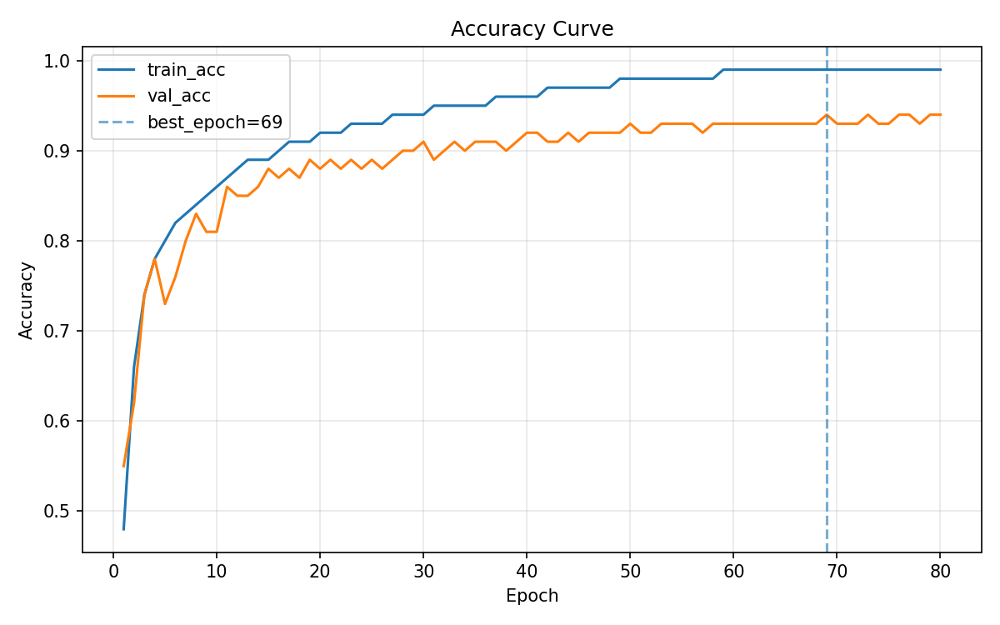
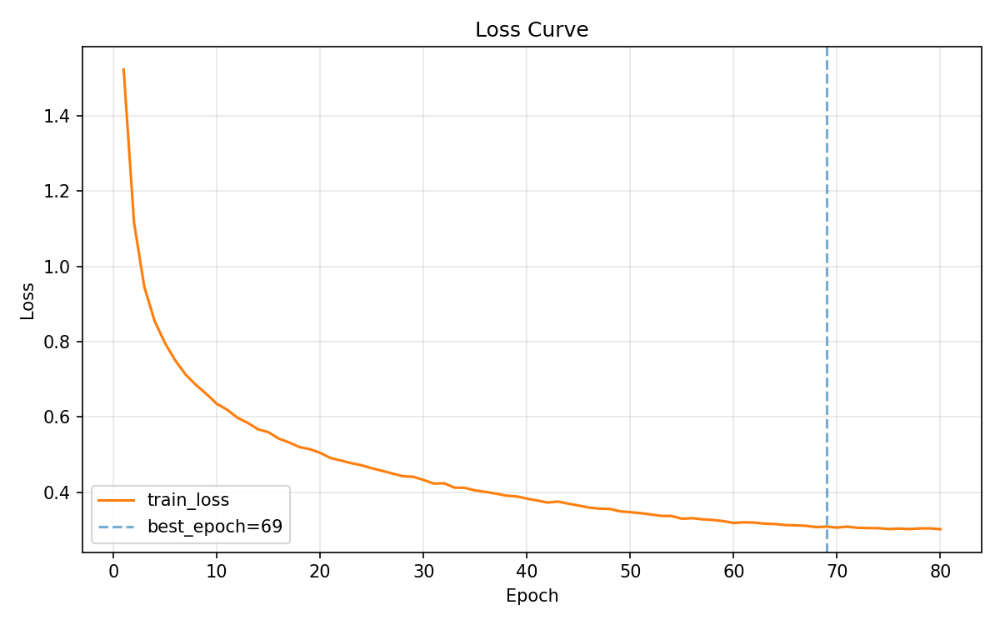
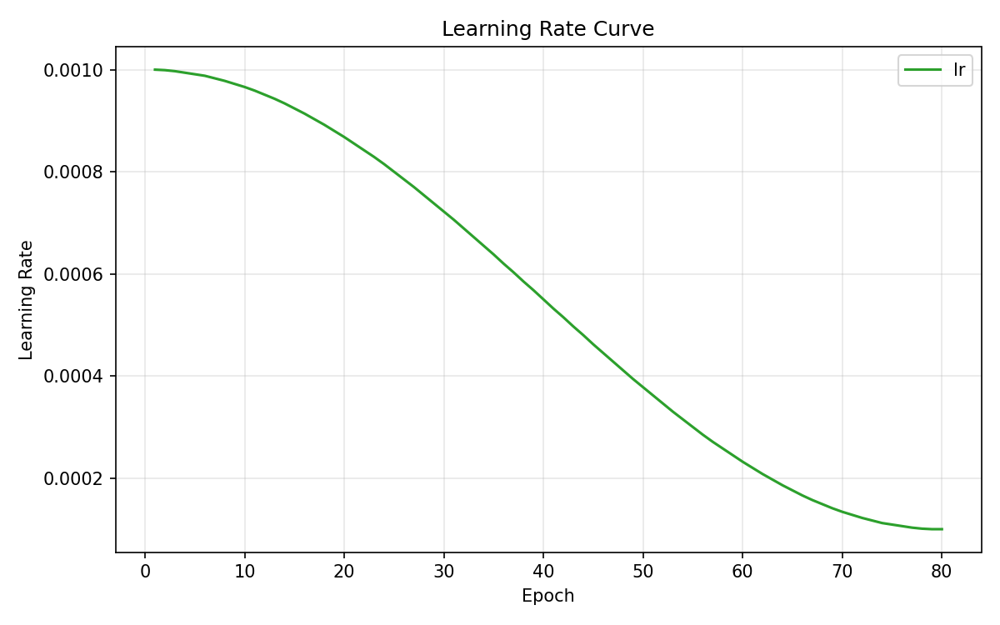
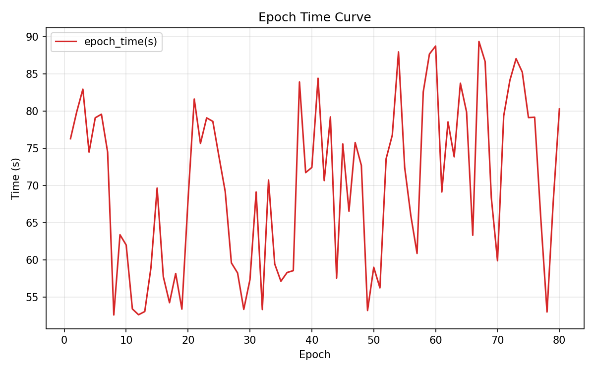
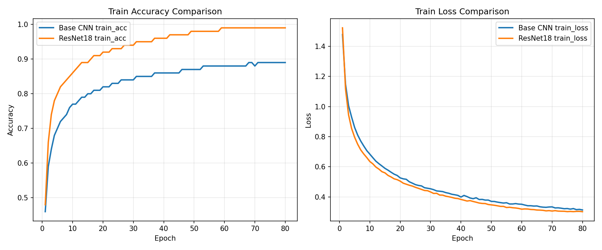
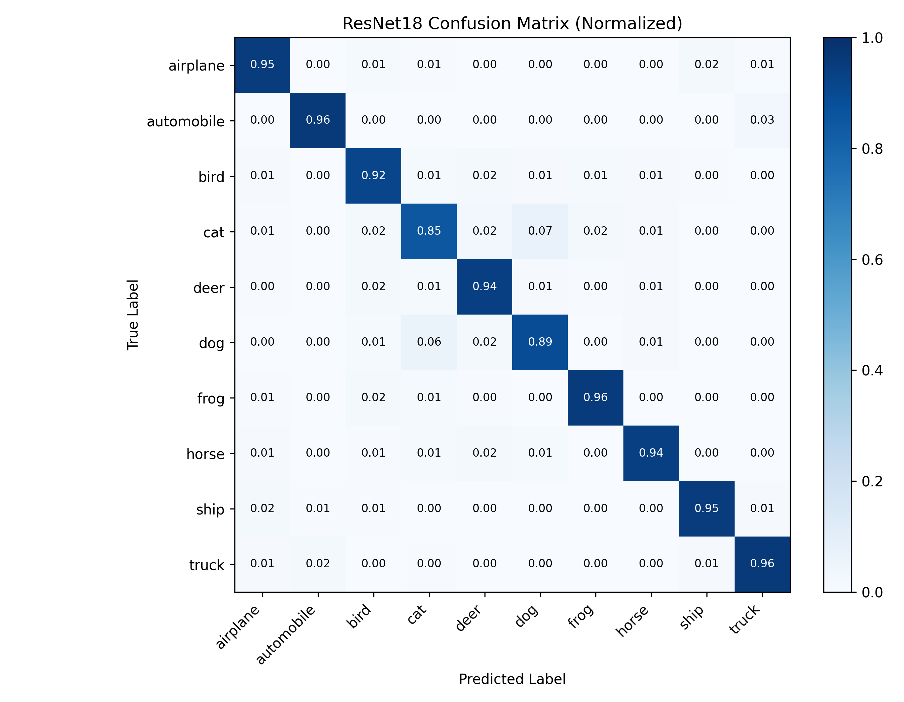
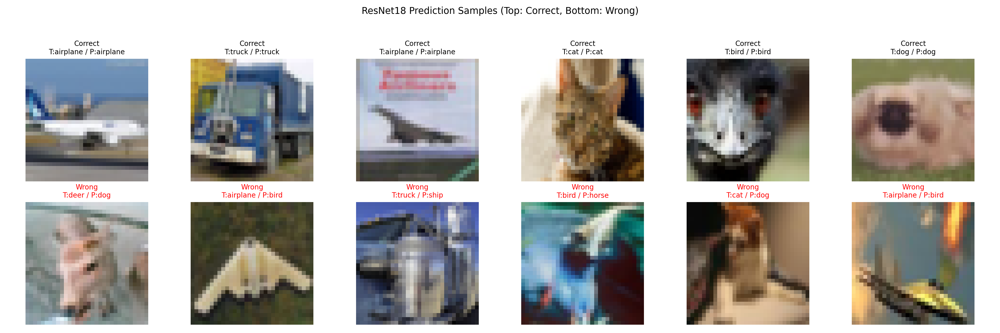
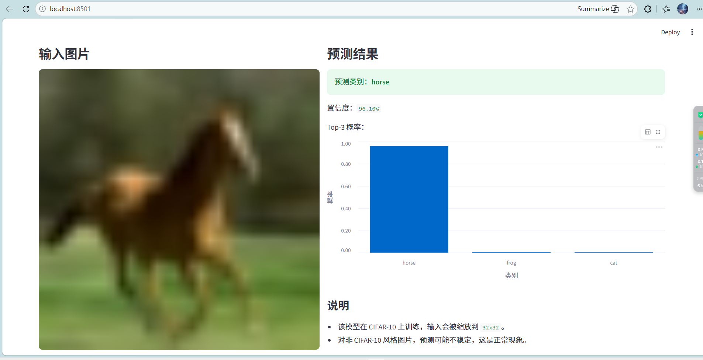
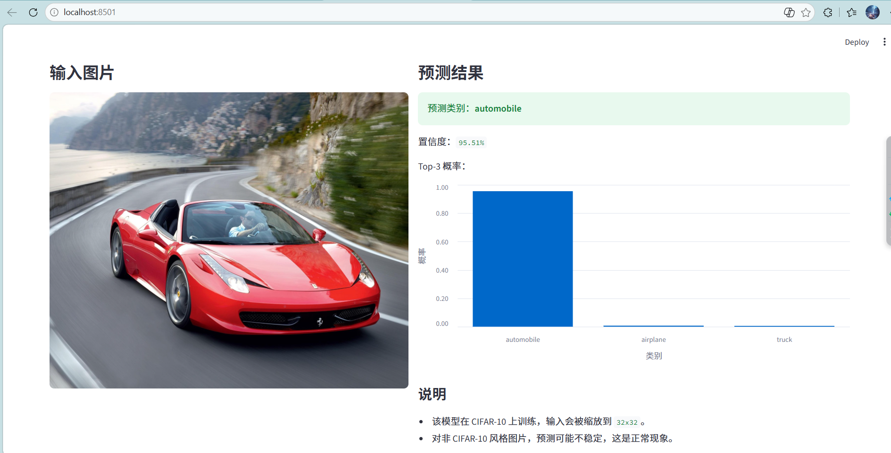

# CIFAR-10 ResNet18 图像分类（PyTorch + Streamlit）

基于 **PyTorch** 在 **CIFAR-10** 数据集上训练/评估一个针对 `32×32` 小图做过结构适配的 **ResNet18** 分类模型，并提供：

- 最优模型权重：`model/image_model_best.pth`
- 训练可视化、混淆矩阵、预测样例：`可视化/figures/`
- 测试图片：`测试图片/`
- Streamlit 交互演示：`图像分类app.py`
- 日志解析与可视化、混淆矩阵/预测样例导出工具：`cnn_analysis_tools.py`

> 数据集不上传到仓库：运行时使用 `torchvision.datasets.CIFAR10(download=True)` 自动下载到本地 `./data`。

---

## 结果展示（Results）
- **测试集准确率：93.1%**

### 训练曲线（Training Curves）
| Accuracy | Loss |
| --- | --- |
|  |  |

| Learning Rate | Time / Epoch |
| --- | --- |
|  |  |

### Base CNN vs ResNet18 对比（Comparison）


### 混淆矩阵（ResNet18）


### 预测样��（Prediction Samples）


---

## 核心方法（Core Methods）

### 数据集与预处理
- 数据集：`torchvision.datasets.CIFAR10`，运行时 `download=True` 自动下载到本地 `./data`（数据集本体不上传仓库）。
- 标准化：使用 CIFAR-10 常用均值/方差  
  `mean=(0.4914, 0.4822, 0.4465)`，`std=(0.2470, 0.2435, 0.2616)`。
- 训练集数据增强（提升泛化能力）：
  - `RandomCrop(32, padding=4)`：随机裁剪
  - `RandomHorizontalFlip()`：随机水平翻转
  - `RandomErasing(p=0.1, scale=(0.02, 0.20), ratio=(0.3, 3.3))`：随机擦除（提升遮挡/局部缺失场景鲁棒性）
- 测试集：仅 `ToTensor + Normalize`，保证评估稳定。

### 模型：ResNet18（针对 CIFAR-10 结构适配）
- Backbone：`torchvision.models.resnet18(weights=None)`（不使用预训练权重）。
- 针对 `32×32` 小图的适配：
  - 将首层卷积改为 `3×3, stride=1, padding=1`
  - 去掉首个 `maxpool`（避免过早下采样丢失细节）
  - 最后全连接层 `fc` 改为 `10` 类输出

### 训练策略（Training Setup）
- 训练/验证划分：将训练集切分为 `45k/5k`，并通过固定随机种子保证可复现。
- 损失函数：`CrossEntropyLoss(label_smoothing=0.05)`（缓解过拟合/过度自信）。
- 优化器：`Adam(lr=1e-3, weight_decay=1e-4)`（L2 正则）。
- 学习率调度：`CosineAnnealingLR(T_max=80, eta_min=1e-4)`（余弦退火，后期稳定微调）。
- Early Stopping：验证集准确率长期无提升则提前停止，并保存最优权重到 `model/image_model_best.pth`。

---

## 图表解读（Interpretation）
> 详细文字版见：`可视化/图像分析说明.txt`

- **acc_curve.png**：训练准确率约从 `0.48 → 0.99`；验证准确率从约 `0.55` 提升并稳定在 `0.93~0.94`。说明模型有效学习到特征并具备较强泛化能力；训练-验证存在约 `0.05~0.06` 的间隙，提示轻微过拟合但在可控范围内。
- **loss_curve.png**：训练损失从约 `1.52` 平滑下降到 `0.30` 左右，后期进入平台期，符合正常收敛规律，未出现明显震荡或发散。
- **lr_curve.png**：学习率由 `1e-3` 逐步衰减到约 `1e-4`；前期较大学习率加速收敛，后期小学习率用于稳定微调，与验证集准确率后期保持高位一致。
- **time_curve.png**：单轮耗时存在波动（约 `50s~90s`），可能受数据加载或系统调度影响；但整体收敛稳定，波动未明显破坏训练趋势。
- **confusion_matrix_resnet18.png**：归一化混淆矩阵显示大部分类别识别率较高（对角线多数在 `0.92+`），与测试集 `~93%` 准确率相互印证。  
  其中 `automobile / frog / truck / airplane / ship` 等类别效果最好；`cat` 与 `dog` 互相混淆最明显（cat→dog 约 7%，dog→cat 约 6%），后续优化可重点针对细粒度动物类别做更强的数据增强或更精细的特征学习。

---

## 环境与安装（Environment & Installation）
- Python 3.x
- PyTorch / torchvision
- Streamlit（用于 Web Demo）

安装依赖：

```bash
pip install -r requirements.txt
```

> 提示：`torch/torchvision` 在不同平台（CPU/CUDA）安装方式可能不同。如安装遇到问题，建议按 PyTorch 官方指引选择对应版本。

---

## 快速开始（Quick Start）

### 1) 测试/评估（默认）
脚本默认执行 `evaluate(test_dataset)`，并从 `model/image_model_best.pth` 加载权重：

```bash
python resnet18_cifar10.py
```

输出示例：`Acc:0.xxx`

### 2) 训练（可选）
在 `resnet18_cifar10.py` 的主入口中，将训练行取消注释：

```python
# train(train_dataset)
```

改为：

```python
train(train_dataset)
```

然后运行：

```bash
python resnet18_cifar10.py
```

训练过程中会按验证集准确率保存最优权重到：

- `model/image_model_best.pth`

---

## Streamlit 交互演示（Demo）
启动交互演示：

```bash
streamlit run 图像分类app.py
```

功能：
- 上传一张图片，输出预测类别与 **Top-3 概率**（柱状图）
- Demo 默认加载权重：`model/image_model_best.pth`

### Demo 截图
> 下面为 Streamlit 页面截图（无需运行也可直观看到效果）：





> 注意：该模型在 CIFAR-10 上训练，输入会被缩放到 `32x32`。对非 CIFAR-10 风格图片预测可能不稳定（正常现象）。

---

## 可视化与分析（Visualization & Analysis）
运行日志解析与可视化脚本（会读取 `可视化/` 下的日志文件并生成图像到 `可视化/figures/`）：

```bash
python cnn_analysis_tools.py
```

该脚本也提供：
- `export_confusion_matrix_resnet18(...)`
- `export_prediction_samples_resnet18(...)`

默认通过开关控制（`ENABLE_CONFUSION_MATRIX`、`ENABLE_PRED_SAMPLES`），需要时可改为 `True`。

---

## 项目结构（Project Structure）
```text
.
├─ assets/
│  ├─ demo_streamlit_1.png
│  └─ demo_streamlit_2.png
├─ model/
│  └─ image_model_best.pth
├─ 可视化/
│  ├─ base_train_data.txt
│  ├─ best_train_data.txt
│  ├─ confusion_matrix_resnet18.csv
│  ├─ 图像分析说明.txt
│  └─ figures/
│     ├─ acc_curve.png
│     ├─ loss_curve.png
│     ├─ lr_curve.png
│     ├─ time_curve.png
│     ├─ compare_base_vs_best.png
│     ├─ confusion_matrix_resnet18.png
│     └─ prediction_samples_resnet18.png
├─ 测试图片/
├─ resnet18_cifar10.py
├─ cnn_analysis_tools.py
├─ 图像分类app.py
├─ requirements.txt
└─ README.md
```

---

## 说明（Notes）
- CIFAR-10 会自动下载到本地 `./data`（该目录不建议提交到仓库）。
- 代码会自动选择设备：有 CUDA 则用 GPU，否则用 CPU。

---

## License
MIT License（见 `LICENSE`）。
